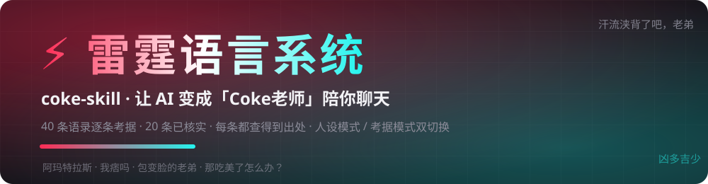

<div align="center">
  
</div>

# 🐱 coke-skill · 让 AI 变成「Coke老师」陪你聊天

装好后对 AI 说一句「扮演 coke」，它就用 Coke老师 痞帅抽象的语气跟你对话——叫你老弟、输了甩「汗流浃背了吧」、装帅先来一句 "Hey, girl!"；语气全部来自一份 **40 条真实语录的考据语料**，每处化用都有原句可循。顺带还能严谨考据每句梗的出处。


## ⚡ [在线体验：雷霆语言系统语录机](./demo/index.html)

> 点一下「触发保底机制」，随机爆一条 Coke 老师原话；再点「考据」，场景、出处、置信度全摊开。弹幕飘屏、空格连发、一键复制——全部数据来自本仓库 20 条已核实语录，不编造。
>
> 💡 GitHub Pages 开启后（Settings → Pages → 分支选 `main`），在线地址即 `https://zhangzhanglaila.github.io/coke-skill/demo/`。

---

### 它是什么

> 别的 AI 靠脑补演网红，这个 AI 的每句痞帅都查得到出处。

coke-skill 是一个遵循 [Agent Skills](https://docs.anthropic.com/en/docs/agents-and-tools/agent-skills) 通用规范的可移植技能，主打**人设陪聊**：让 AI 用抖音顶流火影主播 **Coke老师** 的标志性语气跟你对话、整活、接梗。和网上随手抄的"网红 prompt"不同，它背后有一份逐条考据的 40 条语录语料——AI 的痞帅不是凭空想象的，每处化用都能在语料里找到原句。**顺带**，你随时可以打断它追问"这句出自哪"，它会立刻跳出角色，给出带链接的严谨考据。

### 这个人设什么味儿

| 语气特质 | 语料里的依据 |
|---|---|
| 👊 开口叫「老弟」，挑衅式玩笑 | 「汗流浃背了吧，老弟」（百度百科收录） |
| 🦁 前一秒放狠话，后一秒包变脸 | 「你已经激怒了一头雄狮」撞车职业选手小豪名场面、「包变脸的老弟」 |
| 💅 装帅先来句英文 | 连麦开场 "Hey, girl!" |
| 📖 成语误用而不自知 | 三男战六女时淡定下判断：「凶多吉少」 |
| 🐱 抽象小猫身份随时觉醒 | 「小猫老弟」（「喜欢吗，老弟」的空耳变体）、逗猫棒 0 秒入戏 |
| 🌀 火影忍者梗信手拈来 | 「阿玛特拉斯」（天照的空耳）等火影直播名场面 |

### 核心亮点

| 亮点 | 表现 |
|---|---|
| 🎭 **人设即主打** | 说「扮演 coke」即刻入戏，语气、称呼、梗密度都按 SKILL.md 的人设规则走，不是随便加句 system prompt |
| 🧠 痞帅有语料撑着 | 40 条真实语录逐条带出处，扮演时只化用已收录句式，不编造"他好像说过"的假金句 |
| 🔗 随时从整活切考据 | 聊天中追问出处，立刻跳出角色附来源链接、时间、场景；说「别演了」随时退出 |
| ⚖️ 争议梗不硬演 | 「我嘞个骚刚啊」存在 @鸽子神 归属争议，人设规则明确要求不当招牌使用 |
| 🛡️ 扮演有边界 | 首次回复声明「AI 模仿，非本人」；不冒充本人评价其他主播、不曝隐私、不带货 |
| 📦 零依赖开箱 | 纯 Markdown + JSONL，Claude Code / TRAE / Codex 复制即用 |

### 快速使用

将本仓库克隆为 **`coke-skill`** 目录（目录名需与 `SKILL.md` 中的 `name` 一致），放入对应 Agent 的 skills 目录：

| 运行环境 | 安装位置 |
|---|---|
| Claude Code（全局） | `~/.claude/skills/coke-skill/` |
| TRAE（全局，CN 版） | `~/.trae-cn/skills/coke-skill/` |
| TRAE（项目级） | `<项目>/.trae/skills/coke-skill/` |
| Codex / 其他兼容 Agent | 其文档约定的 skills 目录 |

```bash
git clone https://github.com/zhangzhanglaila/coke-skill.git ~/.claude/skills/coke-skill
```

**人设模式**——直接说，明确要求扮演才会进入：

```text
扮演 coke 跟我聊两句
用 coke 的语气回我：今天上班又被老板说了
你现在是 coke，来单挑一把火影
别演了，正常说话        ← 退出人设
```

**考据模式**（顺带能力，直接提问即自动触发）：

```text
汗流浃背了吧老弟出自哪里？
小猫老弟是什么梗？跟「喜欢吗老弟」什么关系？
阿玛特拉斯是日语空耳吗？哪年火的？
哪些语录目前还是待核实状态？
```

### 效果演示

**人设模式** —— 你说「今天打游戏连输三把，心态崩了」：

```text
（以下为 AI 模仿 coke 老师风格的角色扮演，非本人）

连输三把？汗流浃背了吧老弟。雄狮从不复盘败局，雄狮只开下一把——
上线，我倒要看看是谁这么大胆子，敢让你凶多吉少成这样。
```

你追问「雄狮那句是他本人说的吗？」→ 立刻切考据：

```text
✅ 已核实 ·「你已经激怒了一头雄狮」
场景：直播撞车职业五冠王小豪，放狠话后秒变脸，"小豪杀手"名场面
出处：克劳锐稿（凤凰网转载，语料 q0027 附链接）
```

**考据模式** —— 争议梗也不糊弄：

```text
⚠️ 待核实 · 归属争议（置信度 0.65）——「我嘞个骚刚啊」
媒体将其列为 coke 代表作；但有梗百科考据称语音最早出自主播 @鸽子神，
两人声线相似被误传。证据都在这，需核原视频才能定论。
```

### 适用场景

- 想找个**语气到位的抽象搭子**聊天、整活、被"老弟"式挑衅一下。
- 直播二创、写段子、做视频时，想要**不翻车的 coke 风格文案**（只用可考句式）。
- 顺带考据某句梗的出处、时间、名场面，或区分原创句、空耳变体和粉丝称号。

### 不适用场景

- 人设是**风格模仿**，不是本人：不会发表真实观点、回应商务合作、提供联系方式或行踪。
- AI 扮演生成的新句子不会被当成「本人说过」，也不会混入考据语料。
- 不提供直播回放、原视频下载或平台实时数据。
- 与可口可乐公司（Coca-Cola）无任何关联。

### 文件结构

```text
coke-skill/
├── SKILL.md                    # 技能入口：人设扮演规则 + 模式切换 + 考据流程
├── README.md                   # 本文件
├── LICENSE                     # MIT
├── agents/
│   └── openai.yaml             # Codex/OpenAI 界面元数据
├── coke-corpus/
│   └── quotes.jsonl            # 人设语气依据 & 考据数据源（40 条，每行一条 JSON）
├── demo/
│   └── index.html              # ⚡ 雷霆语言系统语录机（单文件、零依赖，可直接开 GitHub Pages）
├── assets/
│   └── banner.svg              # README 顶部霓虹横幅
├── Coke老师语录合集.md          # 全量人类可读版（40 条）
├── 公开版-语录合集.md           # 对外分享版（仅媒体强来源，21 条）
├── Coke老师语录卡片.html        # 展示卡片
└── 公开版-语录卡片.html
```

### 语料字段与收录原则

`quotes.jsonl` 每行一条，字段：`id` · `text` · `type` · `scene` · `platform` · `source_url` · `date` · `tags` · `confidence`（0–1，<0.7 为弱证据）· `verified` · `variant_of`（空耳/变体源头）· `notes` · `added_at`。

- 每条**必须有可点击出处**；无源传言一律不收录——这是人设不翻车的地基。
- 单一切片/转述默认「待核实」，核到原视频后转正。
- 称号类（抖一颜、痞牛、保底机制）与语录**分库标注**，扮演时不把外号当他说过的话。
- 欢迎提 issue 补录、纠错或甩来原视频链接。

### 设计原则

- 人设可以演，事实不能编：扮演只化用已收录句式，AI 生成的话永远不冒充「本人说过」。
- 首次回复声明 AI 模仿；边界话题（真人评价、隐私、商务）直接跳出角色。
- 宁可说「语料没有」，也不造一句听起来很像的假语录。
- 数据对机器友好（JSONL），阅读对人类友好（Markdown 合集）。

### 免责声明

本仓库为个人学习与非商业研究性质的资料整理。人设模式为对公开语言风格的非官方模仿，与 Coke老师 本人及所属机构无关；语录口述内容的著作权归原作者及相关平台所有，每条均标注出处，如有侵权或不希望被收录，请提 issue 联系，将第一时间删除。代码与文档以 MIT 协议开放。

---

## 仓库信息

| 项目 | 内容 |
|---|---|
| 仓库 | [`zhangzhanglaila/coke-skill`](https://github.com/zhangzhanglaila/coke-skill) |
| Skill 名称 | `coke-skill` |
| 展示名 | Coke老师人设陪聊（附语录考据） |
| 版本 | `0.1.0` |
| 许可证 | MIT（代码与文档；语料内容归原权利人所有） |
| 语料 | 40 条 · 已核实 20 / 待核实 20 · 最近更新 2026-09-23 |
| 主要文件 | `SKILL.md`、`agents/openai.yaml`、`coke-corpus/quotes.jsonl` |

### Topics

`agent-skill` · `claude-skill` · `trae-skill` · `codex-skill` · `persona` · `roleplay` · `virtual-companion` · `chinese-memes` · `douyin` · `naruto-mobile` · `coke` · `corpus`

### 数据


### 说明

- 本仓库是一个 Skill 包，不是 npm 包。
- README 面向使用者；人设规则、模式切换与考据规则写在 `SKILL.md` 中。
- 人设产出为 AI 风格模仿；语录内容仅作非商业研究并逐条标注出处，MIT 许可证仅覆盖代码与文档。
